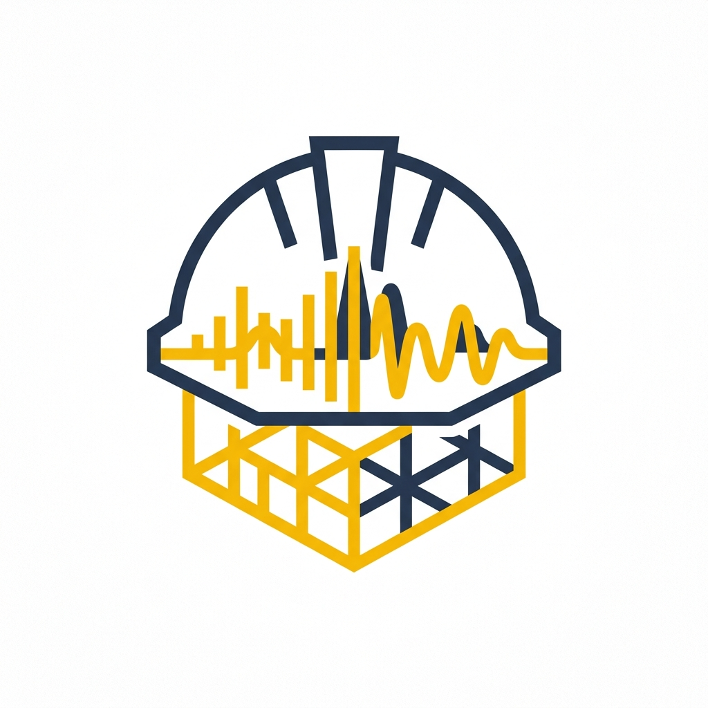
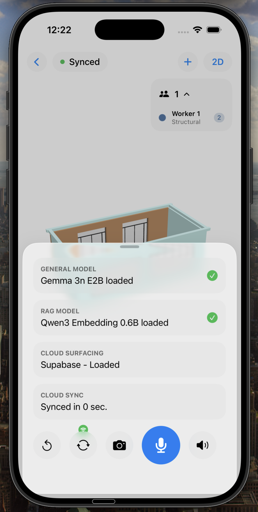
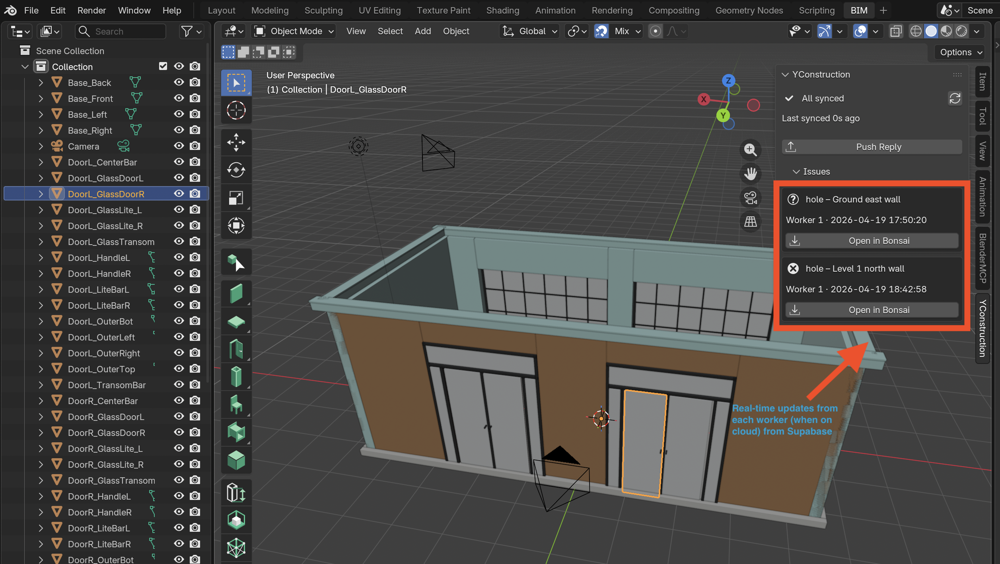

<p align="center">
  
</p>

<h1 align="center">YConstruction</h1>

<p align="center">
  <em>Voice-first construction defect reporting on iPhone — fully on-device AI
  via <a href="https://github.com/cactus-compute/cactus">Cactus</a> (Gemma 3n E2B +
  Whisper + Qwen3 embeddings for on-device RAG), wired to a BIM (IFC) model and a
  Blender review workflow for the architect.</em>
</p>

<table align="center">
  <tr>
    <td align="center"></td>
    <td align="center"></td>
  </tr>
  <tr>
    <td align="center"><sub>Worker's iPhone — on-device Gemma 3n + Whisper + Qwen3, live Supabase sync.</sub></td>
    <td align="center"><sub>Architect's Blender with the YConstruction sidebar — defects stream in live.</sub></td>
  </tr>
</table>

---

## The idea

A site worker walks the building, holds up their iPhone, and says what's wrong:

> *"Crack in the drywall, north wall of room A204, second floor. Looks about a foot long."*

The phone takes a photo, transcribes the voice locally, and a local Gemma 3n
model structures the defect against the project's IFC model — storey, space,
orientation, element type, IFC GUID. No signal, no cloud LLM, no typing.

The defect syncs to Supabase as a BCF topic. The architect at HQ opens Blender
with the Bonsai BIM add-on, clicks a row in the **YConstruction Sync** sidebar,
and the defect appears directly in Bonsai's BCF Topics panel — photo, camera
viewpoint, transcript, everything. They comment, change status, hit **Push
Reply**, and the worker sees it on their phone.

Closed loop: site → model → architect → site.

## Why it's interesting

- **On-device Gemma 3n E2B + Whisper** — via the [Cactus](https://github.com/cactus-compute/cactus)
  framework. No API keys, works on an offline job site.
- **IFC-grounded structuring** — the model is constrained to a closed-set
  vocabulary (the actual storeys / spaces / element types from the loaded IFC),
  so the defect lands on a real building element instead of free text.
- **BCF as the wire format** — the file the architect receives is a standards-
  compliant `.bcfzip`, not a bespoke JSON, so it slots into any BIM tool that
  speaks BCF.
- **The architect stays in Blender** — no extra web dashboard, no browser tab.
  The review happens inside Bonsai's existing BCF UI.

## Architecture

```text
┌───────────────────────────┐       ┌──────────────────┐       ┌───────────────────────┐
│  iPhone — YConstruction   │       │    Supabase      │       │  Mac — Blender+Bonsai │
│                           │       │                  │       │                       │
│  Voice  ──► Whisper       │       │  photos bucket   │       │  Sidebar panel polls  │
│  Photo  ──► Gemma 3n E2B  │ ───►  │  issues bucket   │  ───► │  issues bucket every  │
│  IFC    ──► struct defect │       │  projects bucket │       │  5 s, loads BCF into  │
│                           │       │  Postgres + RLS  │       │  bim.load_bcf_project │
│  ▲ realtime replies   ◄───────────┤                  │◄──────┤  ▲ push BCF reply     │
└───────────────────────────┘       └──────────────────┘       └───────────────────────┘
```

## Repo layout

```text
YConstruction/                  Main SwiftUI iPhone app (the one you build & run)
├── YConstructionApp.swift      App entry — picks a project, hands off to MainView
├── Cactus.swift                Swift bindings to the cactus-ios xcframework (FFI)
├── Models/                     Defect, Severity, ElementIndex, IfcGuid, AppConfig…
├── Services/
│   ├── CactusService.swift     Manages Gemma + Whisper model handles
│   ├── GemmaService.swift      High-level Gemma prompts (report / query / RAG)
│   ├── SceneRendererService    SceneKit renderer for the GLB (3D + 2D overlay)
│   ├── BCFEmitterService.swift Builds a BCF topic zip from a Defect
│   ├── DatabaseService.swift   Supabase Postgres reads/writes
│   ├── SyncService.swift       Online/offline queue + realtime subscription
│   └── …
├── Views/                      Scene3D/2D, MainView, DetailSheet, SyncStatusBadge…
└── Resources/
    ├── DemoProject/            duplex.ifc + duplex.glb + element_index.json
    └── SupabaseConfig.plist    URL + anon key + bucket names

YConstructionMVP/               Pre-production voice-chat MVP kept as a reference
                                (ChatView + ChatViewModel + PhotoTurnCoordinator).
                                Its Services are also compiled into the main app.

cactus/apple/cactus-ios.xcframework/
                                Vendored Cactus iOS framework (arm64 device +
                                arm64 simulator). x86_64 simulator is NOT
                                supported — set ARCHS=arm64 on Intel Macs.

tools/sanjay_bonsai_plugin/     Blender 4.2+ extension. Sidebar in Blender that
                                polls Supabase, loads defects into Bonsai, and
                                pushes BCF replies back.

docs/logo.png                   Project logo (generated via Nano Banana / Gemini).
```

## Local setup

### iPhone app

1. **Open** `YConstruction.xcodeproj` in Xcode.
2. **Sign** the target with your team + a unique bundle ID.
3. **Supabase** — edit `YConstruction/Resources/SupabaseConfig.plist` with your
   project URL and anon/publishable key.
4. **Build & run** on a physical iPhone (arm64 only; a simulator build on Apple
   Silicon also works).
5. **Put the model weights on the phone.** They are deliberately NOT bundled.
   Download them on your Mac with the Cactus CLI:
   ```bash
   cactus download google/gemma-3n-E2B-it
   cactus download openai/whisper-base      # for on-device STT
   cactus download Qwen/Qwen3-Embedding-0.6B  # optional, enables RAG query
   ```
   Then in Finder → iPhone → Files → YConstruction, drag the folders in so they
   end up at `Documents/models/gemma-3n-e2b-it/` and `Documents/models/whisper-base/`.
   The app also has an **Import Model Folder** button for the AirDrop path.

### Blender-side (architect)

See [`tools/sanjay_bonsai_plugin/README.md`](tools/sanjay_bonsai_plugin/README.md)
for the full walkthrough. Short version:

```bash
cd tools
zip -r yconstruction_sync.zip sanjay_bonsai_plugin
```

In Blender: **Edit → Preferences → Get Extensions → Install from Disk →
yconstruction_sync.zip**. Open `duplex.ifc` once per session. Press `N`, pick
the **YConstruction** tab.

## How a defect moves through the system

1. **Worker taps the mic**, says what's wrong. Whisper transcribes locally.
2. **They aim at the issue, tap capture.** A photo is staged.
3. **Gemma 3n** takes the transcript + photo + the project's IFC vocabulary and
   produces a structured `Defect` (type, severity, storey, space, orientation,
   element type, IFC GUID).
4. **Local queue:** the defect + photo are written to disk first so losing
   signal never loses the report.
5. **Sync:** when online, `SyncService` uploads the photo to the `photos`
   bucket, writes the Postgres row, and emits a BCF zip to the `issues` bucket.
6. **Architect's Blender sidebar** sees the new row within 5 s, loads it into
   Bonsai's BCF Topics panel on click.
7. **Reply** from Bonsai → `bim.save_bcf_project` → re-uploaded → the phone's
   Supabase realtime subscription fires → the worker sees the comment.

## What's intentionally out of scope

- **No Spanish / translation pass** in the current build — English-only voice.
- **No cloud LLM fallback** — if the local model isn't present, the app tells
  you so instead of calling an API.
- **Single-turn voice capture**, not continuous streaming — the app auto-sends
  on a pause, rather than running a live duplex session.
- **Demo-grade auth** — Supabase access uses a project-scoped publishable key
  plus RLS. Prod would give each worker a user account.

## Credits

- [Cactus](https://github.com/cactus-compute/cactus) for the on-device LLM runtime.
- [Bonsai](https://bonsaibim.org/) for turning Blender into a real IFC + BCF tool.
- Logo generated with the [Nano Banana](https://github.com/anthropics/claude-code)
  MCP server (Gemini image generation).
